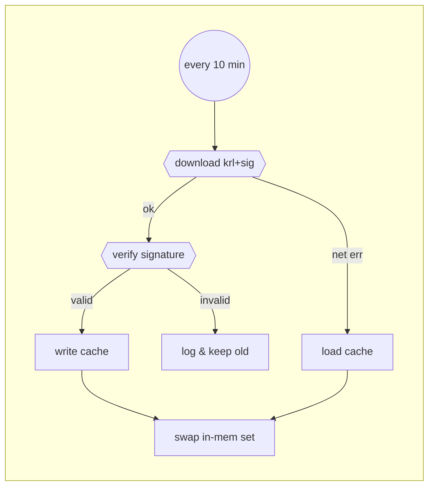

# Swap.io Developer API Key — **Implementation Guide**

> **Audience:** engineers maintaining containerised Swap.io micro‑services (Metanova, Aethra, Routhex …) in any language.
> **Goal:** expose a consistent, secure *developer‑key* gate that works in every stack while remaining zero‑friction inside the Compose network (`swap-io`).

---

## 1  Architecture & trust model

```text
┌──────────────┐  (same host, docker network "swap-io")
│ service A    │───────────────────────────────────────────┐
└──────────────┘                                           │  no key required
                                                           │
┌──────────────┐                                           │
│ service B    │<──────────────────────────────────────────┘
└──────────────┘

┌───────────────┐    public Internet   ┌──────────────┐
│ developer PC  │ ───────────────────> │  service B   │
└───────────────┘   X-API-Key header   └──────────────┘
```

* **Internal calls** (within the *swap‑io* Docker network) skip auth.
* **External calls** supply `X-API-Key: <username>-<signature>`.

  * Signature is the **full** base‑58 Ed25519 signature (≈ 88 chars) of the *username*, produced by the project’s private authority.
  * Any service verifies this using the **shared master public key** and ensures the key’s SHA‑256 digest is **absent** from the KRL.

---

## 2  Key & KRL basics

| Item                  | Value                                                                   |
| --------------------- | ----------------------------------------------------------------------- |
| **Key format**        | `username-<base58_sig>`  (sig = 64‑byte raw / ≈88 byte base58)          |
| **Master public key** |  `KAIRO_MASTER_PUBLIC_KEY` env var (base‑58)                              |
| **KRL location**      | `https://raw.githubusercontent.com/swap-io/kairo-krl/main/krl/keys.krl` |
| **Signature file**    | same path `keys.sig` (detached Ed25519)                                 |
| **Local cache path**  | `$KRL_CACHE_FILE` (default `./static/krl_cache/keys.krl`)               |

`keys.krl` is a plain text file: one SHA‑256 digest per line; always sorted.

---

## 3  Runtime validation flow

1. **Parse** header / query param → `dev_key` string.
2. **Split** on the first `-` ⇒ `(username, sig_b58)`.
3. **Verify signature** using `VerifyKey.verify(username, sig)`.
4. **Hash key** → `digest = sha256(dev_key).hexdigest()`.
5. **Reject** if `digest ∈ REVOKED_KEY_HASHES` (in‑memory set).
6. Otherwise **grant** access; treat `username` as the caller id.

> *❑ Short‑circuit:* if `KAIRO_MASTER_PUBLIC_KEY` is unset, **reject every dev key** & log a warning.

---

## 4  Caching & refresh strategy

* Download `keys.krl` **and** `keys.sig` every *N* minutes (10 is typical).
* Verify signature **before** replacing the in‑memory set.
* On success → overwrite the on‑disk cache and hot‑swap `REVOKED_KEY_HASHES` atomically.
* On any failure → fall back to cached file (if present) to keep the service up.



---

## 5  Reference snippets

### 5.1  Python (AsyncIO)

*Already integrated in **Routhex** — see `src/auth_utils.py` & `src/config.py`.*

### 5.2  Go (Gin / net‑http)

```go
// go.mod: github.com/leanovate/gopter + filippo.io/edwards25519 + github.com/btcsuite/btcutil/base58
func VerifyDevKey(devKey string, revoked map[string]struct{}, pubKey []byte) bool {
    parts := strings.SplitN(devKey, "-", 2)
    if len(parts) != 2 {
        return false
    }
    username, sigB58 := parts[0], parts[1]
    sig := base58.Decode(sigB58)
    if len(sig) != 64 {
        return false
    }
    vk, err := ed25519.NewKeyFromSeed(pubKey)
    if err != nil || !ed25519.Verify(vk.Public().(ed25519.PublicKey), []byte(username), sig) {
        return false
    }
    digest := sha256.Sum256([]byte(devKey))
    _, revoked = revoked[hex.EncodeToString(digest[:])]
    return !revoked
}
```

### 5.3  Rust (Axum / Actix)

```rust
use ed25519_dalek::{Verifier, Signature, VerifyingKey};
use sha2::{Digest, Sha256};

fn verify_dev_key(key: &str, vk: &VerifyingKey, revoked: &HashSet<String>) -> bool {
    let (user, sig_b58) = key.split_once('-')?;
    let sig_bytes = bs58::decode(sig_b58).into_vec().ok()?;
    let sig = Signature::from_bytes(&sig_bytes).ok()?;
    if vk.verify(user.as_bytes(), &sig).is_err() {
        return false;
    }
    let digest = hex::encode(Sha256::digest(key.as_bytes()));
    !revoked.contains(&digest)
}
```

---

## 6  Checklist for service maintainers

1. **Add env vars**

   ```bash
   KAIRO_MASTER_PUBLIC_KEY=<base58 pub key>
   # optional overrides
   KRL_URL=https://raw.githubusercontent.com/swap-dot-io/kairo-krl/main/krl/keys.krl
   KRL_SIG_URL=https://raw.githubusercontent.com/swap-dot-io/kairo-krl/main/krl/keys.sig
   KRL_CACHE_FILE=/app/static/krl_cache/keys.krl
   ```
2. **Import** the shared helper (or port it to your language).
3. Wrap protected endpoints with the *no\_public\_access*-equivalent guard.
4. Start the **KRL refresh cron** in your app’s startup hook.
5. Document developer endpoints so colleagues know which `X-API-Key` to use.

---

## 7  Troubleshooting

| Symptom                                            | Likely cause                              | Fix                                                                        |
| -------------------------------------------------- | ----------------------------------------- | -------------------------------------------------------------------------- |
| *Signature must be 64 bytes*                       | Service still expects 44‑char keys        | Re‑generate keys after June 2025 migration.                                |
| Every key rejected & log says *public key missing* | `KAIRO_MASTER_PUBLIC_KEY` not in env        | Export it or mount `.env` file.                                            |
| Keys never revoke                                  | Cronjob not running / can’t reach GitHub  | Check APScheduler logs, firewall, proxy.                                   |
| Service crashes on startup                         | Cache missing **and** network unreachable | Ship a seed `keys.krl` + `keys.sig` with the repo or raise retry back‑off. |

---

© 2025 Swap.io – keep keys safe & code 💪
